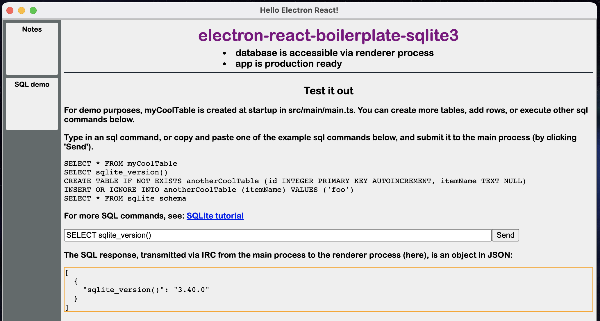

If you want to use sqlite3 on the front end (renderer process) of your electron app + you plan on packaging it at some point, [electron-react-boilerplate-sqlite3](https://github.com/wds4/electron-react-boilerplate-sqlite3) has got you covered!

This template is a Dec 2022 fork of the popular [electron-react-boilerplate](https://github.com/electron-react-boilerplate/electron-react-boilerplate) (erb), augmented with the widely used [sqlite3](https://github.com/TryGhost/node-sqlite3) for persistent local data storage. erb is a relatively well fleshed-out starting point for building an electron app with a number of tools that come packaged with it, including [React Refresh](https://www.npmjs.com/package/react-refresh) for hot reloading, [webpack](https://webpack.js.org) for bundling and [electron-builder](https://www.electron.build) for packaging.

If you're in a hurry, skip to the bottom and follow the instructions to Install erb-sqlite3 (this template), followed by the Development and/or Packaging steps depending on your purposes. To learn how this template incorporates sqlite3 into erb, read on. I apologize that this guide is a bit longwinded; I have provided as much detail as possible in the hopes that it can be followed by those with very little dev experience.

## Similar templates

As of the time of this writing, I know of two similar repos (erb + sqlite3): [erb-sqlite-example](https://github.com/amilajack/erb-sqlite-example) and [erb-better-sqlite3-example](https://github.com/amilajack/erb-better-sqlite3-example). There is a third repo, [Electron-React-Sqlite](https://github.com/fmacedoo/ers-stack), which does not fork from erb and has none of its frills. Although none of these repos did everything I was looking for, I learned quite a lot from each of them.

[erb-sqlite-example](https://github.com/amilajack/erb-sqlite-example) is a good simple solution to adding sqlite3 to erb, but it only sets sqlite3 up in the main process. It does not show how to access your database from the renderer process. If your primary goal is simply to learn about native dependencies (sqlite3 being a prime example of a native dependency) without any other complicated issues getting in the way (like [IPC, inter-process communication](https://www.electronjs.org/docs/latest/tutorial/ipc) between the main and renderer processes), [erb-sqlite-example](https://github.com/amilajack/erb-sqlite-example) is a good place to look.

[erb-better-sqlite3-example](https://github.com/amilajack/erb-better-sqlite3-example) uses [better-sqlite3](https://github.com/WiseLibs/better-sqlite3) instead of [sqlite3](https://github.com/TryGhost/node-sqlite3). (I've never used better sqlite3 so I can't comment on their relative advantages and disadvantages.) Like the above, this one does not show you how to access your database through the renderer process. [erb-better-sqlite3-example](https://github.com/amilajack/erb-better-sqlite3-example) does set your app up for packaging. However, it stores the database in a location that may not be write accessible to the packaged app, as I discuss below.

Another useful resource is [Electron-React-Sqlite](https://github.com/fmacedoo/ers-stack), with a walkthrough of its creation by the author on [medium](https://fmacedoo.medium.com/standalone-application-with-electron-react-and-sqlite-stack-9536a8b5a7b9). This does not start as a fork of electron-react-boilerplate or any other boilerplate; it is a good template to use if you want something without the bells and whistles of erb, or if you simply want to learn how to build an electron app from scratch. This is where I learned how to set up the IPC channel to allow the renderer process to access the database, which I will build on top of erb, below.

## Where to store the database

One question you may ask when using sqlite3: where is the database stored? Its location in developer mode may or may not be the same as in the packaged app. In both cases, the paths are stitched together in src/main/main.ts.

In [erb-better-sqlite3-example](https://github.com/amilajack/erb-better-sqlite3-example), in both dev and production mode, the database is placed in release/app/sql. To construct the full path, webpackPaths.appPath is used in dev mode; __dirname is used for production mode. (See [main.js](https://github.com/amilajack/erb-better-sqlite3-example/blob/main/src/main/main.ts)) My understanding is that this could cause problems for the packaged app if it does not have the proper write access to release/app or its subdirectories; see e.g. [stackoverflow: Electron and sqlite3 issue after packaging app](https://stackoverflow.com/questions/39719888/electron-and-sqlite3-issue-after-packaging-app) for a discussion.

So unlike [erb-better-sqlite3-example](https://github.com/amilajack/erb-better-sqlite3-example), to avoid permission issues in the packaged app, in [main.js](https://github.com/wds4/electron-react-boilerplate-sqlite3/blob/main/src/main/main.ts) my template uses app.getPath('userData') (for reasons outlined in the above stackoverflow link). In dev mode, I use webpackPaths.appPath which yields release/app, same as erb-better-sqlite3; but for production mode, instead of __dirname, I use app.getPath('userData') which yields a path that is OS-specific that is used exactly for this purpose: a place for the user's downloaded app to store local data. In macOS, the full path might be something like: /Users/bob/Library/Application Support/Electron/myCoolDatabase.sqlite3.

For education purposes, my app displays both of these paths explicitly on the front end. The main process knows these directory locations, so I used IPC to transmit that information to the renderer process.

## Recreation of this template from erb: why?

If you are a novice to electron, there are a lot of things you can learn by going through the process that I did to create this template. Topics include:
<li>native dependencies</li>
<li>main vs renderer processes, and how to use IPC for them to communicate</li>
<li>developer vs packaged modes and where files are stored (not the same in these two modes!)</li>
<li>some basic SQL commands</li>

## Recreation of this template from erb: steps

If you want to create this template from scratch, follow the steps below (summarized in [commit history](https://github.com/wds4/electron-react-boilerplate-sqlite3/commits)).

In the terminal, navigate to wherever it is you store your apps (on a mac it might look like: Users/Bob/Documents/GitHub) and clone [electron-react-boilerplate](https://github.com/electron-react-boilerplate/electron-react-boilerplate).

```bash
git clone --depth 1 --branch main https://github.com/electron-react-boilerplate/electron-react-boilerplate.git your-project-name
cd your-project-name
npm install
npm start
```

With npm start, you ought to see the erb window appear in developer mode. You can quit (control-C) and restart from time to time as you follow the steps below. However, React Refresh will allow you to see many of your changes reflected in your app as you make them, without the need to stop and restart your app.

erb has a [two-package structure](https://www.electron.build/tutorials/two-package-structure.html) to deal with [native dependencies](https://www.electronjs.org/docs/latest/tutorial/using-native-node-modules). Since sqlite3 is a native dependency, we follow these steps to install it:


```bash
cd release/app
npm install sqlite3
npm run postinstall
cd ../..
```
You should see sqlite3 as a dependency (note: not a devDependency!) in the package.json which is in release/app.
Postinstall runs one of the scripts in package.json.

In src/main/main.ts (main process), add sqlite3 with the following lines:
```bash
import sqlite from 'sqlite3';
const sqlite3 = sqlite.verbose();
```

We will also need to access webpackPaths; we will use this momentarily.

```bash
import webpackPaths from '../../.erb/configs/webpack.paths'
```

Give your database a name and knit together the paths to the database; one for developer mode, one for production. See the above discussion for why we do this. We are going to use the constant, isDebug (which indicates development mode), to indicate which mode we are in, so we need to make sure to place these lines after the spot where isDebug is defined. In developer mode, we are going to place the database in a new folder called sql which we will place in release/app, so don't forget to make the sql folder!

```bash
const databaseName = "myCoolDatabase.sqlite3";
const sqlPath_dev = path.join(webpackPaths.appPath,'sql',databaseName);
const sqlPath_prod = path.join(app.getPath('userData'), databaseName)
const sqlPath = isDebug
  ? sqlPath_dev
  : sqlPath_prod
```

Create and connect to the sqlite3 database:
```bash
const db = new sqlite3.Database(sqlPath, (err) => {
    if (err) console.error('Database opening error: ', err);
});
```

Create a table if it doesn't already exist:

```bash
db.serialize(() => {
  db.run('CREATE TABLE IF NOT EXISTS myCoolTable (info TEXT NULL)');
});
```

Add the following line to close the database once all windows are closed:

```bash
db.close();
```
Add the folder: `sql` to `release/app`. This is where the database will be placed in dev mode. You may or may not want to place your database in .gitignore with the following line:

```bash
release/app/sql
```

This will prevent changes in the database on your local machine from being pushed to github.com during development, which can be a pain, especially if you anticipate your database getting big.

We turn our attention now to the renderer process. First, in src/renderer/index.tsx, we set up the function, asyncSql, which will relay sql commands and replies back and forth between the main process and the renderer process.

```bash
export const asyncSql = async (sql) => {
    return new Promise((resolve) => {
        window.electron.ipcRenderer.once('asynchronous-sql-reply', (arg) => {
            resolve(arg)
        });
        window.electron.ipcRenderer.sendMessage('asynchronous-sql-command', sql);
    })
}
```

(Note that erb exposes the "ipc-example" IPC channel to help us know the proper syntax.)

Go back to main.ts and set up a listener for the "asynchronous-sql-reply" and "asynchronous-sql-command" IPC channels used by asyncSql. I placed it just after the "ipc-example" listener.

```bash
ipcMain.on('asynchronous-sql-command', async (event, sql) => {
    db.all(sql, (err, result) => {
        event.reply('asynchronous-sql-reply', result);
    });
});
```

Note that unlike the "ipc-example" channel, I am using one name for communication from the renderer process to the main process (asynchronous-sql-command), but a different name (asynchronous-sql-reply) for messages going from the main process back to the renderer process.

We will now take what we have just built and see it in action. Make a new file, sqlDemoApp.js, in src/renderer/pages. As you can see, it imports
the function we created, asyncSql at the top with this line:

```bash
import { asyncSql } from "../index.tsx";
```

asyncSql is used here:

```bash
function send(sql) {
    asyncSql(sql).then((result) => setResponse(result));
}
```

I am using hooks to send the message, but you can use vanilla javascript if you want. Main thing is to feed our sql commands (sql) into the asyncSql function. I have supplied a few simple sql commands to test out. If all goes well, sqlite3 will generate the desired response (e.g. information from or about the database) and send it back to the renderer window, which will display the response at the bottom of the page.

Oh don't forget to import the new page with an import statement at the top of sqlDemoPage:

```bash
import sqlDemoApp from "./sqlDemoApp.js"
```

and then to use it in the body of the page:

```bash
<SqlDemoApp />
```

We are now (almost) done! In fact, if you navigate to the second page and click the Send button, you ought to see a response (in the orange box) indicating what version of sqlite3 you are using (3.40.0 at the time of this writing). You can play around with other sql commands as well by copy and pasting them into the field, or type in your own.

Finally, purely for the fun of it, I set up another listener in main.ts so that I can communicate information regarding dev and packaging paths to the sql database from the main process to the renderer process and show the paths on the front end.

```bash
const sqlPathsInfo = [sqlPath, sqlPath_dev, sqlPath_prod, isDebug]
ipcMain.on('ipc-show-userDataPaths', async (event, arg) => {
  event.reply('ipc-show-userDataPaths', sqlPathsInfo);
});
```

I use this channel in home.js:

```bash
window.electron.ipcRenderer.once('ipc-show-userDataPaths', (arg) => {
    document.getElementById("dbLocationContainer").innerHTML = arg[0];
    document.getElementById("dbLocationDevContainer").innerHTML = arg[1];
    document.getElementById("dbLocationProdContainer").innerHTML = arg[2];
    const devMode = arg[3]
    if (devMode) {
      document.getElementById("devModeContainer").innerHTML = "developer"
    }
    if (!devMode) {
      document.getElementById("devModeContainer").innerHTML = "production"
    }
});
window.electron.ipcRenderer.sendMessage('ipc-show-userDataPaths');
```

On the home page of the app at the bottom, you should now see a display of the paths to the sqlite database in dev mode, in package mode, and in the current mode (which for now is dev).

That's it, erb-sqlite3 is complete! Now test it in developer and packaged modes to see that it works as intended.

## Install erb-sqlite3

You can skip all of the above steps if you wish to see it in action. Simply clone this repo and install dependencies:

```bash
git clone --depth 1 --branch main https://github.com/wds4/electron-react-boilerplate-sqlite3.git your-project-name
cd your-project-name
npm install
```

You will also need to do this to install sqlite3, which is a dependency in [release/app/package.json](https://github.com/wds4/electron-react-boilerplate-sqlite3/blob/main/release/app/package.json), but not in [package.json](https://github.com/wds4/electron-react-boilerplate-sqlite3/blob/main/package.json).

```bash
cd release/app
npm install sqlite3
npm run postinstall
cd ../..
```

## Development

Start the app in the `dev` environment:

```bash
npm start
```

## Packaging for Production

To package apps for the local platform:

```bash
npm run package
```

The packaged app can now be found in release/app/build.

For more packaging options, including packaging for other platforms and debugging production build with devtools, see [erb packaging options](https://electron-react-boilerplate.js.org/docs/packaging).

## License

MIT © [Electron React Boilerplate](https://github.com/electron-react-boilerplate)
